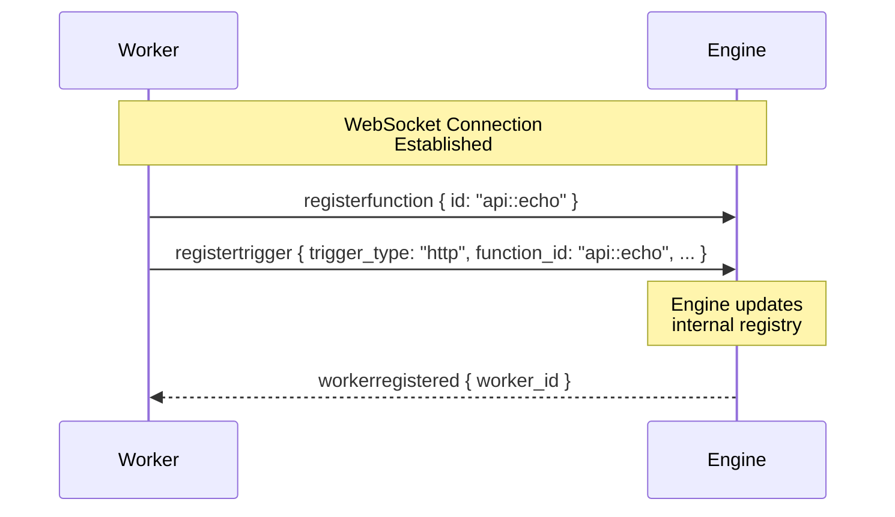
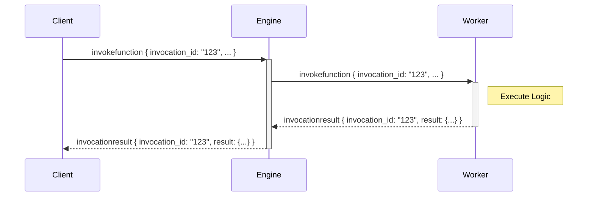

The iii Engine uses a WebSocket-based JSON protocol for communication between the engine and workers.

## Message Types

| Message Type | Direction | Description |
|--------------|-----------|-------------|
| `registerfunction` | Worker → Engine | Declares a function available for execution |
| `registertrigger` | Worker → Engine | Configures a trigger (API route, event, cron) |
| `invokefunction` | Bidirectional | Requests execution of a specific function |
| `invocationresult` | Bidirectional | Returns the result of a function execution |
| `ping` / `pong` | Bidirectional | Keep-alive mechanism |

## Connection Flow



## Invocation Lifecycle



---

## Message Schemas

### `registerfunction`

| Field | Type | Required | Description |
|-------|------|----------|-------------|
| `type` | `string` | Yes | `"registerfunction"` |
| `id` | `string` | Yes | Function identifier (e.g., `"api::echo"`) |
| `description` | `string` | No | Human-readable description |
| `request_format` | `object` | No | JSON Schema for input validation |
| `response_format` | `object` | No | JSON Schema for output documentation |
| `metadata` | `object` | No | Arbitrary key-value metadata |

```typescript
{
  type: 'registerfunction',
  id: 'service::function',
  description?: 'Function description',
  request_format?: { ... },
  response_format?: { ... },
  metadata?: { ... }
}
```

### `registertrigger`

| Field | Type | Required | Description |
|-------|------|----------|-------------|
| `type` | `string` | Yes | `"registertrigger"` |
| `id` | `string` | Yes | Unique trigger identifier |
| `trigger_type` | `string` | Yes | `"http"`, `"durable:subscriber"`, `"cron"`, `"log"` |
| `function_id` | `string` | Yes | Target function identifier |
| `config` | `object` | Yes | Trigger-specific configuration |

**Trigger config by type:**

| Trigger Type | Config Fields |
|--------------|---------------|
| `http` | `{ api_path: string, http_method: string }` |
| `durable:subscriber` | `{ topic: string }` |
| `cron` | `{ expression: string }` |
| `log` | `{ level: string }` |

```typescript
{
  type: 'registertrigger',
  id: 'unique-trigger-id',
  trigger_type: 'http' | 'durable:subscriber' | 'cron' | 'log',
  function_id: 'service::function',
  config: { ... }
}
```

### `invokefunction`

| Field | Type | Required | Description |
|-------|------|----------|-------------|
| `type` | `string` | Yes | `"invokefunction"` |
| `invocation_id` | `string` | No | Required for synchronous calls |
| `function_id` | `string` | Yes | Target function identifier |
| `data` | `object` | Yes | Function input payload |

```typescript
{
  type: 'invokefunction',
  invocation_id?: 'unique-id',
  function_id: 'service::function',
  data: { ... }
}
```

### `invocationresult`

| Field | Type | Required | Description |
|-------|------|----------|-------------|
| `type` | `string` | Yes | `"invocationresult"` |
| `invocation_id` | `string` | Yes | Matches the request `invocation_id` |
| `function_id` | `string` | Yes | Executed function identifier |
| `result` | `object` | No | Success result (mutually exclusive with `error`) |
| `error` | `object` | No | Error result with `message` and `code` |

```typescript
{
  type: 'invocationresult',
  invocation_id: 'unique-id',
  function_id: 'service::function',
  result?: { ... },
  error?: {
    message: 'Error description',
    code: 'ERROR_CODE'
  }
}
```

---

## Stream Sub-Protocol

The Streams worker uses a specialized sub-protocol for real-time state synchronization.

### Client → Engine

#### `Join`

| Field | Type | Required | Description |
|-------|------|----------|-------------|
| `type` | `string` | Yes | `"Join"` |
| `subscription_id` | `string` | Yes | Client-generated subscription identifier |
| `stream_name` | `string` | Yes | Target stream name |
| `group_id` | `string` | Yes | Group identifier |
| `id` | `string` | No | Item identifier for single-item subscriptions |

```typescript
{
  type: 'Join',
  subscription_id: 'sub-123',
  stream_name: 'todos',
  group_id: 'user-456',
  id: 'item-789'
}
```

#### `Leave`

| Field | Type | Required | Description |
|-------|------|----------|-------------|
| `type` | `string` | Yes | `"Leave"` |
| `subscription_id` | `string` | Yes | Subscription to terminate |

```typescript
{
  type: 'Leave',
  subscription_id: 'sub-123'
}
```

### Engine → Client

| Field | Type | Description |
|-------|------|-------------|
| `timestamp` | `number` | Unix timestamp in milliseconds |
| `stream_name` | `string` | Source stream name |
| `group_id` | `string` | Group identifier |
| `event.type` | `string` | `"Sync"`, `"Create"`, `"Update"`, `"Delete"`, `"Event"` |
| `event.data` | `object` | Event payload |

```typescript
{
  timestamp: 1234567890,
  stream_name: 'todos',
  group_id: 'user-456',
  event: {
    type: 'Sync' | 'Create' | 'Update' | 'Delete' | 'Event',
    data: { ... }
  }
}
```
