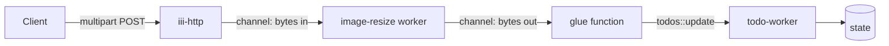

<Info title="Track 1 — Your first useful backend">
  This is tutorial **2 of 3** in Track 1. Estimated time: 15 minutes.
  Builds on [Tutorial 1](/tutorials/crud-api-in-10-minutes).
</Info>

## What you'll build

Extend the todo API from Tutorial 1 so each todo can have an attached
thumbnail. You'll add `image-resize` (a Rust worker that does
EXIF-correct JPEG/PNG/WebP resizing) and stream binary data between
workers using **channels**.

## Prerequisites

- Completed [Tutorial 1](/tutorials/crud-api-in-10-minutes).
- Engine running with `todo-worker` and `iii-http` already added.

## Steps

### 1. Add the image-resize worker

```bash
iii worker add image-resize
```

{/* TODO: confirm registered function ids — likely `image::resize` with channel I/O for input/output */}

### 2. Add a multipart upload route

Wire a new HTTP trigger that accepts a file and forwards it to the
resizer over a channel.

```yaml
{/* TODO: real HTTP trigger config for multipart upload + channel binding to image::resize */}
```

### 3. Pipe the resized output into todo state

Register a small glue function (TypeScript or Python) that:

1. Reads the resized bytes from the output channel.
2. Calls `todos::update` with a `thumbnail` field (base64 or storage ref).

{/* TODO: code stub — TS handler signature using channels API; reference how-to/use-channels */}

### 4. Try it end-to-end

```bash
curl -X POST http://localhost:PORT/todos/:id/thumbnail \
  -F 'image=@./photo.jpg'
```

Then `GET /todos/:id` and confirm a `thumbnail` field is present.

## Result

You added a heavyweight image processing capability without writing image
code, without choosing a library, and without spinning up a separate
service. The resizer runs as just another worker. Channels carry the
binary payload without bloating function arguments.

## What you just composed



## Next steps

- [Tutorial 3 — Scheduled jobs and observability](/tutorials/scheduled-jobs-and-observability)
- [How-to: Use channels](/how-to/use-channels) for the channel API.
- [Reference: image-resize](https://github.com/iii-hq/workers/tree/main/image-resize)
  on GitHub.
