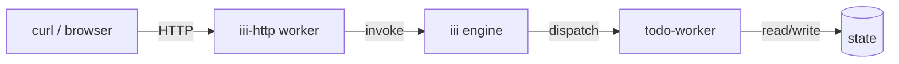

<Info title="Track 1 — Your first useful backend">
  This is tutorial **1 of 3** in Track 1. Estimated time: 10 minutes.
</Info>

## What you'll build

A working REST API for a todo list — `GET /todos`, `POST /todos`,
`PATCH /todos/:id`, `DELETE /todos/:id` — with persistent state, **without
writing any HTTP server code yourself**. You compose two registered workers:

- `todo-worker` — provides the CRUD functions and persistence.
- `iii-http` — exposes those functions as HTTP routes.

## Prerequisites

- iii engine running locally ([Install](/install)).
- The `iii` CLI on your `PATH`.
- An empty project directory.

## Steps

### 1. Initialize the project

{/* TODO: confirm the exact `iii init` / scaffold command for an empty workspace */}

```bash
mkdir my-todo-api && cd my-todo-api
iii init
```

### 2. Add the todo worker

```bash
iii worker add todo-worker
```

{/* TODO: sample expected output — registered functions list (todos::list, todos::create, todos::update, todos::delete) */}

### 3. Add the HTTP worker

```bash
iii worker add iii-http
```

{/* TODO: confirm whether iii-http is auto-added by `iii init` or must be added explicitly */}

### 4. Wire HTTP triggers to todo functions

Create `triggers/todos.yaml`:

```yaml
{/* TODO: real YAML once trigger-config schema is locked.
   Should map:
     POST   /todos       → todos::create
     GET    /todos       → todos::list
     PATCH  /todos/:id   → todos::update
     DELETE /todos/:id   → todos::delete
*/}
```

### 5. Start the engine and exercise the API

```bash
iii --config config.yaml
```

In another terminal:

```bash
curl -X POST http://localhost:PORT/todos -d '{"title":"buy milk"}'
curl http://localhost:PORT/todos
```

{/* TODO: real default HTTP port from iii-http worker manifest */}

## Result

You now have a persistent REST API. No Express, no FastAPI, no database
client written by you. The `todo-worker` brought the functions and storage;
`iii-http` brought the routing.

## What you just composed



## Next steps

- [Tutorial 2 — Add image uploads](/tutorials/add-image-uploads): compose
  `image-resize` into the same app.
- [How-to: Expose an HTTP endpoint](/how-to/expose-http-endpoint) for
  custom routes.
- [Reference: iii-http](/workers/iii-http) for the full trigger config.
