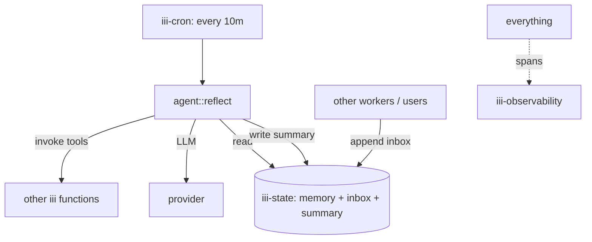

<Info title="Track 3 — iii for AI agents">
  This is tutorial **4 of 4** in Track 3. Estimated time: 30 minutes.
  Builds on [Tutorial 8](/tutorials/build-a-tool-using-agent).
</Info>

## What you'll build

A long-running agent that:

- Stores facts and observations in `iii-state` (durable memory).
- Wakes up on a cron schedule to **reflect** — summarize recent
  observations, prune low-value memories, decide what to do next.
- Can take action autonomously by invoking other iii functions.

This is the substrate pattern for "always-on" agents: assistants that
keep working between user messages.

## Prerequisites

- Completed [Tutorial 8](/tutorials/build-a-tool-using-agent) (or
  another working agent worker).
- `iii-state`, `iii-cron`, and `iii-observability` registered.

## Steps

### 1. Model agent memory in iii-state

Pick a keyspace layout. A simple split:

| Key pattern | Purpose |
|---|---|
| `agents/{id}/profile` | Stable identity, goals, constraints |
| `agents/{id}/memory/{ulid}` | Append-only observations |
| `agents/{id}/summary` | Compacted long-term summary |
| `agents/{id}/inbox/{ulid}` | Pending messages / events to react to |

{/* TODO: code stub showing iii-state writes for an observation:
   await iii.state.set(`agents/${id}/memory/${ulid()}`, { ts, source, text });
*/}

### 2. Register the reflection function

Register `agent::reflect`. Inside:

1. List recent `memory/*` and `inbox/*` entries.
2. Call the LLM with the existing `summary` + recent items to produce
   an updated summary and an action list.
3. Persist the new summary.
4. For each action, invoke the relevant iii function.

{/* TODO: code skeleton for the reflect handler */}

### 3. Schedule reflection with cron

```yaml
{/* TODO: cron trigger config — every 10 minutes for example, bound to agent::reflect
   { type: cron, function_id: agent::reflect, config: { expression: "0 */10 * * * * *" } }
*/}
```

### 4. Feed the agent

Have other workers or external systems append to the agent's inbox:

```bash
iii state set agents/a1/inbox/$(ulid) '{"source":"slack","text":"new ticket #123"}'
```

The next reflection tick will incorporate the message and decide what
to do.

### 5. Watch it think

In the console, every reflection tick produces a trace:
`cron:tick → agent::reflect → (LLM) → tool calls`. Use
`iii-observability` to see what the agent is doing and how often.

## Result

You have an autonomous agent with durable memory and a heartbeat. It
keeps state across restarts (memory lives in `iii-state`), it acts
without needing a user prompt (cron drives it), and every action is
observable.

## What you just composed



## Where to go from here

- Combine with [Tutorial 7](/tutorials/expose-functions-as-mcp-tools) so
  a human can also drive the same agent through Claude or Cursor.
- [Reference: iii-state](/workers/iii-state) and
  [iii-cron](/workers/iii-cron).
- [How-to: React to state changes](/how-to/react-to-state-changes) for
  event-driven (rather than scheduled) reflection.
