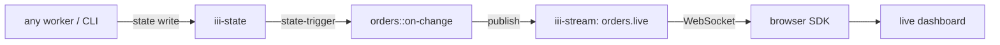

<Info title="Track 2 — Adopt iii incrementally">
  This is tutorial **3 of 3** in Track 2. Estimated time: 25 minutes.
</Info>

## What you'll build

A live dashboard page that updates whenever the underlying state
changes. You write zero WebSocket code — `iii-stream` and the browser
SDK handle the transport.

The example domain: a "live orders" page that updates whenever any
worker writes to the `orders/*` keyspace.

## Prerequisites

- iii engine running.
- A simple frontend project (Vite + React or plain HTML works).

## Steps

### 1. Add the stream worker

```bash
iii worker add iii-stream
```

### 2. React to state changes and publish to a stream

Register a function `orders::on-change` triggered by state writes under
`orders/*`. Inside, it publishes the change onto a stream named
`orders.live`.

{/* TODO: code stub — state-trigger registration + iii-stream publish call */}

### 3. Subscribe from the browser

Install the browser SDK in your frontend:

```bash
pnpm add iii-browser-sdk
```

Connect and subscribe:

```ts
{/* TODO: real iii-browser-sdk snippet:
   const iii = new IIIBrowser({ url: 'ws://localhost:49134' });
   iii.streams.subscribe('orders.live', (event) => updateUI(event));
*/}
```

### 4. Drive a change and watch the UI update

Write to state from the CLI:

```bash
iii state set orders/o_123 '{"status":"paid","total":4200}'
```

{/* TODO: confirm exact CLI for state writes */}

The browser dashboard updates within milliseconds.

## Result

You have a real-time UI without a WebSocket server, without a pub/sub
broker, and without any reconnection logic of your own. The state
trigger fans out automatically; the browser SDK handles transport and
reconnect.

## What you just composed



## Next steps

- Move on to [Track 3](/tutorials/expose-functions-as-mcp-tools) and
  start using iii as an agent substrate.
- [How-to: Stream realtime data](/how-to/stream-realtime-data)
- [How-to: Use iii in the browser](/how-to/use-iii-in-the-browser)
- [Reference: iii-stream](/workers/iii-stream)
